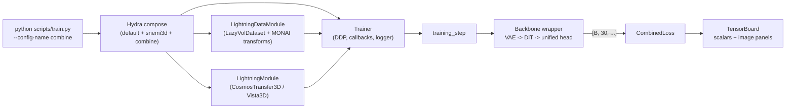

# brainbow

A PyTorch Lightning infrastructure for **spatially-coloured (brainbow-style)
instance segmentation** of 3-D connectomics volumes, adapted from the
`neurons` research codebase and built on top of NVIDIA's
Cosmos-Transfer2.5 video-diffusion backbone (DiT + VAE).

> **First time here?**  Start with [`doc/INDEX.md`](doc/INDEX.md), which
> routes you to the right doc for the question you're asking.  TL;DR:
> [`STRUCTURE.md`](doc/STRUCTURE.md) for the file map,
> [`WALKTHROUGH.md`](doc/WALKTHROUGH.md) for what one batch actually
> does, [`GOTCHAS.md`](doc/GOTCHAS.md) when something goes silently
> wrong.

## Architecture at a glance



Two end-to-end backbones live under `brainbow/models/`:

- **`CosmosTransfer3DWrapper`** — Cosmos-Transfer 2.5 DiT + Wan VAE;
  one unified 30-channel head.
- **`Vista3DWrapper`** — SegResNetDS2; the same unified 30-channel head
  for fast local iteration.

For the channel layout and the math behind the loss, see
[`doc/ARCHITECT.md`](doc/ARCHITECT.md).

## What it does

For every connected-component label `> 0` in a volumetric segmentation,
`brainbow` trains one **30-channel per-voxel head**:

| channels | field | meaning |
|---:|---|---|
| 0 | `raw` | raw image reconstruction |
| 1 | `sem` | foreground probability |
| 2-4 | `dir` | unit vector to the instance centroid |
| 5-10 | `cov` | upper-triangle covariance field |
| 11-13 | `avg` | normalised `(z, y, x)` instance centroid |
| 14-29 | `emb` | 16-D discriminative embedding |

The loss also derives **12-direction, second-order face affinity** from
both `avg` and `emb` and supervises those soft affinities against a
label-derived binary target:

```
aff_field[c] = exp(-tau * sum_i |field[i] - shift_replicate(field[i], dir_c)|)
```

Voxels in the same instance share their predicted centroid so the
kernel evaluates to ≈ 1; voxels across an instance boundary disagree
on it and the kernel decays.  The 12 directions are
`±1` and `±2` along each of Z, Y, and X.

## Layout

The full file-by-file map lives in [`doc/STRUCTURE.md`](doc/STRUCTURE.md).
Skim of the top level:

```
brainbow/
├── configs/             Hydra configs (default → snemi3d → combine)
├── brainbow/            importable package (losses, models, modules,
│                        datasets, datamodules, transforms, inference,
│                        preprocessors, metrics, visualizer, callbacks)
├── doc/                 STRUCTURE / ORGANIZATION / ARCHITECT / WALKTHROUGH
│                        / GOTCHAS / CONTRIBUTING / INDEX
├── scripts/             train.py entry point + dataset downloaders
├── tests/               pytest suite
├── pyproject.toml
└── requirements.txt     pinned lockfile (see top-of-file for usage)
```

## Install

```bash
pip install -e ".[cosmos,dev]"
# optional: RAPIDS GPU clustering
pip install -e ".[gpu-cu13]" --extra-index-url https://pypi.nvidia.com
```

## Train

```bash
# Plain SNEMI3D run:
python scripts/train.py --config-name snemi3d

# Multi-dataset (SNEMI3D + neurons + MICrONS) joint training:
python scripts/train.py --config-name combine

# DDP, custom batch size:
python scripts/train.py --config-name combine data.batch_size=4 training.devices=4

# Example: disable avg-affinity supervision.
python scripts/train.py --config-name combine loss.weight_aff_avg.weight=0.0
```

### GPU memory: avoiding slow OOM drift on long runs

On long DDP runs (especially with `freeze_dit_backbone: <N>` phased
unfreeze, `compile: max-autotune`, or `max_hard_pairs: 0`) the PyTorch
caching allocator's reserved pool tends to creep upward over hours
even though live tensors are stable.  Two settings make the
difference between "stable at 90 %" and "OOM at epoch 30":

```bash
# 1.  Enable expandable allocator segments BEFORE launching python.
#     Mitigates fragmentation; near-zero runtime cost.  Read at CUDA
#     init, so it must be exported (cannot be applied in-process).
export PYTORCH_CUDA_ALLOC_CONF=expandable_segments:True

# 2.  Empty the cache around validation (callback already on by
#     default in snemi3d.yaml; turn on for custom configs):
#         callbacks.cuda_empty_cache_before_val: true
#     This now empties on BOTH sides of validation so the val-time
#     high-water mark does not stay reserved in the training pool.

python scripts/train.py --config-name snemi3d
```

Watch the trajectory in TensorBoard under the `cuda_memory/*` tags
(emitted by `CudaMemoryLoggerCallback`, on by default):

| Pattern                                                | Diagnosis                                                     |
|--------------------------------------------------------|---------------------------------------------------------------|
| `allocated_gb` flat, `reserved_gb` rising              | fragmentation — set `PYTORCH_CUDA_ALLOC_CONF` as above.       |
| `allocated_gb` and `reserved_gb` both rising           | tensor leak — inspect callbacks (image_logger, custom hooks). |
| sawtooth coupled to val epochs                         | val peak polluting train pool — enable the callback above.    |
| sudden step at the epoch boundary set by `freeze_dit_backbone` | DiT unfreeze added grads + AdamW state; expected. Enable `model.gradient_checkpointing: true` for headroom. |

## Loss

```python
from brainbow.losses import CombinedLoss, HEAD_CHANNELS, slice_head

loss_fn = CombinedLoss()
# head:      [B, 30, D, H, W]
# labels:    [B, D, H, W]
# raw_image: [B, 1, D, H, W]
out = loss_fn(head, {"labels": labels, "raw_image": raw_image})
fields = slice_head(head)  # raw / sem / dir / cov / avg / emb views
```

## Tests

```bash
pytest tests/ -q
```

## Where to look first

| You want to ...                                                | Open                                                          |
| -------------------------------------------------------------- | ------------------------------------------------------------- |
| Skim the codebase before doing anything                        | [`doc/STRUCTURE.md`](doc/STRUCTURE.md)                        |
| Understand what one training batch actually does               | [`doc/WALKTHROUGH.md`](doc/WALKTHROUGH.md)                    |
| Know the unified head's math + channel layout                  | [`doc/ARCHITECT.md`](doc/ARCHITECT.md)                        |
| Add a new dataset / loss / backbone / transform                | [`doc/CONTRIBUTING.md`](doc/CONTRIBUTING.md)                  |
| Debug a silent failure (UMAP→PCA, head dropping, freeze, ...)  | [`doc/GOTCHAS.md`](doc/GOTCHAS.md)                            |
| Tour all docs at once                                          | [`doc/INDEX.md`](doc/INDEX.md)                                |

## License

MIT.  See `LICENSE`.
