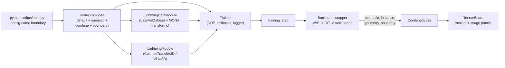

# brainbow

A PyTorch Lightning infrastructure for **spatially-coloured (brainbow-style)
instance segmentation** of 3-D connectomics volumes, adapted from the
`neurons` research codebase and built on top of NVIDIA's
Cosmos-Transfer2.5 video-diffusion backbone (DiT + VAE).

> **First time here?**  Start with [`doc/INDEX.md`](doc/INDEX.md), which
> routes you to the right doc for the question you're asking.  TL;DR:
> [`STRUCTURE.md`](doc/STRUCTURE.md) for the file map,
> [`WALKTHROUGH.md`](doc/WALKTHROUGH.md) for what one batch actually
> does, [`GOTCHAS.md`](doc/GOTCHAS.md) when something goes silently
> wrong.

## Architecture at a glance



Two end-to-end backbones live under `brainbow/models/`:

- **`CosmosTransfer3DWrapper`** — Cosmos-Transfer 2.5 DiT + Wan VAE; four heads
  (semantic, instance, geometry, boundary).
- **`Vista3DWrapper`** — SegResNetDS2; three heads (no boundary head).

For the per-head channel layouts and the math behind each loss, see
[`doc/ARCHITECT.md`](doc/ARCHITECT.md).

## What it does

For every connected-component label `> 0` in a volumetric segmentation,
`brainbow` builds a **16-channel per-voxel target** directly from the
label volume + raw EM image -- no learnable target parameters:

|   channels  | meaning                                                                   |
|-------------|---------------------------------------------------------------------------|
|    0        | **raw** := raw image intensity at the voxel                               |
|    1 - 3    | RGB := normalised (z, y, x) of the instance's **min** (bounding-box min)  |
|    4 - 6    | RGB := normalised (z, y, x) of the instance's **avg** (centroid)          |
|    7 - 9    | RGB := normalised (z, y, x) of the instance's **max** (bounding-box max)  |
|   10 - 15   | **aff** := binary face-affinity to 6 neighbours in Z-Y-X order (T, B, U, D, L, R) |

Each coordinate is divided by the patch dimensions `(D, H, W)` so the
nine localisation channels live in `[0, 1]` regardless of anisotropy
or patch size.  The six affinity channels use **SAME / replicate
padding** at the crop boundary (boundary voxels are self-connected,
`aff = 1`) so every voxel has a well-defined target without masking.
The target map is computed in a single vectorised pass (no Python
loops over voxels): SciPy's `find_objects` + `np.bincount` on CPU,
`torch.scatter_reduce_` on CUDA.

The model is a `CosmosTransfer3DWrapper` with a dedicated 16-channel
`"brainbow"` head attached after the shared VAE-decoder refinement
stack (the existing `semantic`, `instance`, and `geometry` heads remain
available and can be combined via weighted sums in `CombinedLoss`).

## Layout

The full file-by-file map lives in [`doc/STRUCTURE.md`](doc/STRUCTURE.md).
Skim of the top level:

```
brainbow/
├── configs/             Hydra configs (default → snemi3d → combine → boundary)
├── brainbow/            importable package (losses, models, modules,
│                        datasets, datamodules, transforms, inference,
│                        preprocessors, metrics, visualizer, callbacks)
├── doc/                 STRUCTURE / ORGANIZATION / ARCHITECT / WALKTHROUGH
│                        / GOTCHAS / CONTRIBUTING / INDEX
├── scripts/             train.py entry point + dataset downloaders
├── tests/               pytest suite
├── pyproject.toml
└── requirements.txt     pinned lockfile (see top-of-file for usage)
```

## Install

```bash
pip install -e ".[cosmos,dev]"
# optional: RAPIDS GPU clustering
pip install -e ".[gpu-cu13]" --extra-index-url https://pypi.nvidia.com
```

## Train

```bash
# Plain SNEMI3D run with the standard three-head recipe:
python scripts/train.py --config-name snemi3d

# Turn on the boundary head (16-channel: raw + instance-colour + face-affinity):
python scripts/train.py --config-name boundary

# DDP, custom batch size:
python scripts/train.py --config-name boundary data.batch_size=4 training.devices=4
```

### GPU memory: avoiding slow OOM drift on long runs

On long DDP runs (especially with `freeze_dit_backbone: <N>` phased
unfreeze, `compile: max-autotune`, or `max_hard_pairs: 0`) the PyTorch
caching allocator's reserved pool tends to creep upward over hours
even though live tensors are stable.  Two settings make the
difference between "stable at 90 %" and "OOM at epoch 30":

```bash
# 1.  Enable expandable allocator segments BEFORE launching python.
#     Mitigates fragmentation; near-zero runtime cost.  Read at CUDA
#     init, so it must be exported (cannot be applied in-process).
export PYTORCH_CUDA_ALLOC_CONF=expandable_segments:True

# 2.  Empty the cache around validation (callback already on by
#     default in snemi3d.yaml; turn on for custom configs):
#         callbacks.cuda_empty_cache_before_val: true
#     This now empties on BOTH sides of validation so the val-time
#     high-water mark does not stay reserved in the training pool.

python scripts/train.py --config-name snemi3d
```

Watch the trajectory in TensorBoard under the `cuda_memory/*` tags
(emitted by `CudaMemoryLoggerCallback`, on by default):

| Pattern                                                | Diagnosis                                                     |
|--------------------------------------------------------|---------------------------------------------------------------|
| `allocated_gb` flat, `reserved_gb` rising              | fragmentation — set `PYTORCH_CUDA_ALLOC_CONF` as above.       |
| `allocated_gb` and `reserved_gb` both rising           | tensor leak — inspect callbacks (image_logger, custom hooks). |
| sawtooth coupled to val epochs                         | val peak polluting train pool — enable the callback above.    |
| sudden step at the epoch boundary set by `freeze_dit_backbone` | DiT unfreeze added grads + AdamW state; expected. Enable `model.gradient_checkpointing: true` for headroom. |

## Loss

```python
from brainbow.losses import BoundaryLoss, build_boundary_target

loss_fn = BoundaryLoss(
    loss_loc="smooth_l1",    # regression loss for the 9 localisation channels
    loss_raw="l1",            # regression loss for channel 0 (raw intensity)
    weight_min=1.0,           # bounding-box min RGB (channels 1-3)
    weight_avg=1.0,           # centroid RGB           (channels 4-6)
    weight_max=1.0,           # bounding-box max RGB   (channels 7-9)
    weight_raw=1.0,           # raw-intensity regression
    weight_dice=1.0,          # soft-Dice on sigmoid(face-affinity logits)
    weight_ce=0.0,            # optional binary CE on the 6 affinity channels
    weight_iou=0.0,           # optional soft-IoU     on the 6 affinity channels
    aff_eps=1.0e-5,           # smoothing in the soft-Dice denominator
    foreground_only_loc=True, # mask the 9 localisation channels by labels > 0
)

# prediction: [B, 16, D, H, W]  |  labels: [B, D, H, W]  |  image: [B, D, H, W]
out = loss_fn(prediction, labels, image)
# out -> {"loss", "raw", "min", "avg", "max", "aff",
#         "aff_ce", "aff_dice", "aff_iou"}
```

The ``aff`` term aggregates ``weight_dice * aff_dice + weight_ce * aff_ce
+ weight_iou * aff_iou`` so you can mix Dice / CE / IoU on the six face-
affinity channels without breaking the rest of the loss dict.

## Tests

```bash
pytest tests/ -q
```

## Where to look first

| You want to ...                                                | Open                                                          |
| -------------------------------------------------------------- | ------------------------------------------------------------- |
| Skim the codebase before doing anything                        | [`doc/STRUCTURE.md`](doc/STRUCTURE.md)                        |
| Understand what one training batch actually does               | [`doc/WALKTHROUGH.md`](doc/WALKTHROUGH.md)                    |
| Know each head's math + channel layout                         | [`doc/ARCHITECT.md`](doc/ARCHITECT.md)                        |
| See every config knob with provenance                          | [`configs/example_annotated.yaml`](configs/example_annotated.yaml) |
| Add a new dataset / loss / backbone / transform                | [`doc/CONTRIBUTING.md`](doc/CONTRIBUTING.md)                  |
| Debug a silent failure (UMAP→PCA, head dropping, freeze, ...)  | [`doc/GOTCHAS.md`](doc/GOTCHAS.md)                            |
| Tour all docs at once                                          | [`doc/INDEX.md`](doc/INDEX.md)                                |

## License

MIT.  See `LICENSE`.
