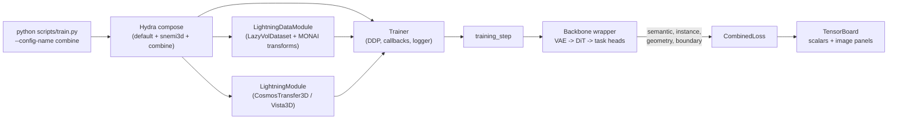

# brainbow

A PyTorch Lightning infrastructure for **spatially-coloured (brainbow-style)
instance segmentation** of 3-D connectomics volumes, adapted from the
`neurons` research codebase and built on top of NVIDIA's
Cosmos-Transfer2.5 video-diffusion backbone (DiT + VAE).

> **First time here?**  Start with [`doc/INDEX.md`](doc/INDEX.md), which
> routes you to the right doc for the question you're asking.  TL;DR:
> [`STRUCTURE.md`](doc/STRUCTURE.md) for the file map,
> [`WALKTHROUGH.md`](doc/WALKTHROUGH.md) for what one batch actually
> does, [`GOTCHAS.md`](doc/GOTCHAS.md) when something goes silently
> wrong.

## Architecture at a glance



Two end-to-end backbones live under `brainbow/models/`:

- **`CosmosTransfer3DWrapper`** — Cosmos-Transfer 2.5 DiT + Wan VAE; four heads
  (semantic, instance, geometry, boundary).
- **`Vista3DWrapper`** — SegResNetDS2; three heads (no boundary head).

For the per-head channel layouts and the math behind each loss, see
[`doc/ARCHITECT.md`](doc/ARCHITECT.md).

## What it does

For every connected-component label `> 0` in a volumetric segmentation,
`brainbow` builds a **10-channel per-voxel target** directly from the
label volume + raw EM image -- no learnable target parameters:

|   channels  | meaning                                                                   |
|-------------|---------------------------------------------------------------------------|
|    0        | **raw**      := raw image intensity at the voxel                          |
|    1 - 3    | **avg**      := normalised (z, y, x) of the instance centroid             |
|    4 - 9    | **aff_pred** := binary face-affinity to 6 neighbours, Z-Y-X order (T, B, U, D, L, R) |

The 3 `avg` channels are divided by the patch dimensions `(D, H, W)`
so they live in `[0, 1]` regardless of anisotropy or patch size; they
are zero on background voxels.  The 6 affinity channels use **SAME /
replicate padding** at the crop boundary (foreground voxels at the
edge are self-connected, `aff = 1`) and are masked to `0` on
background voxels so every voxel has a well-defined target without
explicit masking elsewhere.  The target map is computed in a single
vectorised pass (no Python loops over voxels): `numpy.bincount` on
CPU, `torch.scatter_add_` on CUDA.

On top of the model's *direct* affinity prediction (ch 4-9), the loss
also derives a **soft 6-face affinity from the predicted avgloc**
(ch 1-3) and supervises that derived signal against the same binary
aff target:

```
aff_avg[c] = exp(-tau * sum_i |avg[i] - shift_replicate(avg[i], dir_c)|)
```

Voxels in the same instance share their predicted centroid so the
kernel evaluates to ≈ 1; voxels across an instance boundary disagree
on it and the kernel decays.  `weight_aff_pred` and `weight_aff_avg`
scale the two paths separately; both go through the same CE / Dice /
IoU sub-losses.  Conceptually the supervision is `1 + 3 + 6 + 6 = 16`
slots even though the model head still emits only 10 channels.

The model is a `CosmosTransfer3DWrapper` with a dedicated 10-channel
boundary head attached after the shared VAE-decoder refinement stack;
the `semantic`, `instance`, and `geometry` heads can be combined with
it via weighted sums in `CombinedLoss`.

## Layout

The full file-by-file map lives in [`doc/STRUCTURE.md`](doc/STRUCTURE.md).
Skim of the top level:

```
brainbow/
├── configs/             Hydra configs (default → snemi3d → combine)
├── brainbow/            importable package (losses, models, modules,
│                        datasets, datamodules, transforms, inference,
│                        preprocessors, metrics, visualizer, callbacks)
├── doc/                 STRUCTURE / ORGANIZATION / ARCHITECT / WALKTHROUGH
│                        / GOTCHAS / CONTRIBUTING / INDEX
├── scripts/             train.py entry point + dataset downloaders
├── tests/               pytest suite
├── pyproject.toml
└── requirements.txt     pinned lockfile (see top-of-file for usage)
```

## Install

```bash
pip install -e ".[cosmos,dev]"
# optional: RAPIDS GPU clustering
pip install -e ".[gpu-cu13]" --extra-index-url https://pypi.nvidia.com
```

## Train

```bash
# Plain SNEMI3D run with the standard three-head recipe:
python scripts/train.py --config-name snemi3d

# Multi-dataset (SNEMI3D + neurons + MICrONS) joint training:
python scripts/train.py --config-name combine

# DDP, custom batch size:
python scripts/train.py --config-name combine data.batch_size=4 training.devices=4

# Boundary-head-only training: override loss weights inline.
python scripts/train.py --config-name combine \
    loss.weight_semantic=0.0 loss.weight_instance=0.0 loss.weight_geometry=0.0
```

### GPU memory: avoiding slow OOM drift on long runs

On long DDP runs (especially with `freeze_dit_backbone: <N>` phased
unfreeze, `compile: max-autotune`, or `max_hard_pairs: 0`) the PyTorch
caching allocator's reserved pool tends to creep upward over hours
even though live tensors are stable.  Two settings make the
difference between "stable at 90 %" and "OOM at epoch 30":

```bash
# 1.  Enable expandable allocator segments BEFORE launching python.
#     Mitigates fragmentation; near-zero runtime cost.  Read at CUDA
#     init, so it must be exported (cannot be applied in-process).
export PYTORCH_CUDA_ALLOC_CONF=expandable_segments:True

# 2.  Empty the cache around validation (callback already on by
#     default in snemi3d.yaml; turn on for custom configs):
#         callbacks.cuda_empty_cache_before_val: true
#     This now empties on BOTH sides of validation so the val-time
#     high-water mark does not stay reserved in the training pool.

python scripts/train.py --config-name snemi3d
```

Watch the trajectory in TensorBoard under the `cuda_memory/*` tags
(emitted by `CudaMemoryLoggerCallback`, on by default):

| Pattern                                                | Diagnosis                                                     |
|--------------------------------------------------------|---------------------------------------------------------------|
| `allocated_gb` flat, `reserved_gb` rising              | fragmentation — set `PYTORCH_CUDA_ALLOC_CONF` as above.       |
| `allocated_gb` and `reserved_gb` both rising           | tensor leak — inspect callbacks (image_logger, custom hooks). |
| sawtooth coupled to val epochs                         | val peak polluting train pool — enable the callback above.    |
| sudden step at the epoch boundary set by `freeze_dit_backbone` | DiT unfreeze added grads + AdamW state; expected. Enable `model.gradient_checkpointing: true` for headroom. |

## Loss

```python
from brainbow.losses import BoundaryLoss, build_boundary_target

loss_fn = BoundaryLoss(
    loss_avg="smooth_l1",     # regression loss for the 3 avg channels (1-3)
    loss_raw="l1",             # regression loss for the raw channel (0)
    weight_avg=1.0,            # avg centroid regression (channels 1-3)
    weight_raw=1.0,            # raw-intensity regression (channel 0)
    weight_aff_pred=1.0,       # path weight on direct aff prediction (channels 4-9)
    weight_aff_avg=1.0,        # path weight on aff derived from predicted avgloc
    tau=1.0,                   # bandwidth of soft_aff_from_avg's kernel
    weight_dice=1.0,           # soft-Dice on sigmoid(aff); applied to BOTH paths
    weight_ce=0.0,             # optional binary CE; applied to BOTH paths
    weight_iou=0.0,            # optional soft-IoU; applied to BOTH paths
    aff_eps=1.0e-5,            # smoothing in the soft-Dice denominator
    foreground_only_loc=True,  # mask the 3 avg channels by labels > 0
    background=0,              # mask aff target to 0 where labels == background
)

# prediction: [B, 10, D, H, W]  (post-sigmoid)
# labels:     [B, D, H, W]      (instance ids; 0 = background)
# image:      [B, D, H, W]      (normalised raw EM)
out = loss_fn(prediction, labels, image)
# out -> {"loss", "raw", "avg", "aff",
#         "aff_pred", "aff_avg",
#         "aff_pred_{ce,dice,iou}", "aff_avg_{ce,dice,iou}"}
```

The ``aff`` term aggregates ``weight_aff_pred * aff_pred +
weight_aff_avg * aff_avg``, where each per-path total is
``weight_dice * dice + weight_ce * ce + weight_iou * iou`` on the six
face-affinity channels.  Disabling either path (``weight_aff_pred=0``
or ``weight_aff_avg=0``) zeros out its sub-terms entirely.

## Tests

```bash
pytest tests/ -q
```

## Where to look first

| You want to ...                                                | Open                                                          |
| -------------------------------------------------------------- | ------------------------------------------------------------- |
| Skim the codebase before doing anything                        | [`doc/STRUCTURE.md`](doc/STRUCTURE.md)                        |
| Understand what one training batch actually does               | [`doc/WALKTHROUGH.md`](doc/WALKTHROUGH.md)                    |
| Know each head's math + channel layout                         | [`doc/ARCHITECT.md`](doc/ARCHITECT.md)                        |
| Add a new dataset / loss / backbone / transform                | [`doc/CONTRIBUTING.md`](doc/CONTRIBUTING.md)                  |
| Debug a silent failure (UMAP→PCA, head dropping, freeze, ...)  | [`doc/GOTCHAS.md`](doc/GOTCHAS.md)                            |
| Tour all docs at once                                          | [`doc/INDEX.md`](doc/INDEX.md)                                |

## License

MIT.  See `LICENSE`.
