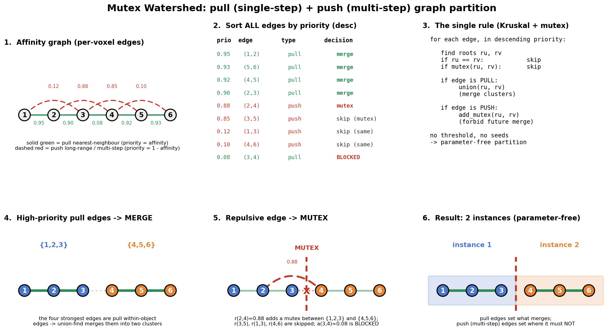

# Brainbow — Mutex Watershed Head & Agglomeration

How Brainbow turns a backbone's dense predictions into an instance
segmentation **without any threshold or seed parameter**, using the
Mutex Watershed (Wolf et al. 2018).

This doc covers the full path: the affinity + sem + raw head layout, the
loss that supervises it, the parameter-free agglomeration algorithm and
its from-scratch implementation, and where each piece is wired into
training / evaluation / visualisation.

- Channel layout & helpers: [`brainbow/losses/_common.py`](../brainbow/losses/_common.py)
- Loss: [`brainbow/losses/affinity.py`](../brainbow/losses/affinity.py)
- Algorithm: [`brainbow/inference/mutex_watershed.py`](../brainbow/inference/mutex_watershed.py)
- Eval wiring: [`brainbow/modules/base.py`](../brainbow/modules/base.py)
- Visualisation: [`brainbow/callbacks/tensorboard/heads.py`](../brainbow/callbacks/tensorboard/heads.py),
  [`brainbow/callbacks/tensorboard/image_logger.py`](../brainbow/callbacks/tensorboard/image_logger.py)

---

## 1. The head

Every backbone (`Cosmos3Nano3DWrapper`, `CosmosPredict3DWrapper`,
`CosmosTransfer3DWrapper`, `Vista3DWrapper`) emits **one** dense tensor
`[B, HEAD_CHANNELS, D, H, W]`.  The canonical layout is the single source
of truth in `brainbow/losses/_common.py`:

```
ch  0 .. N_AFF-1 : aff   (N_AFF=14)  sigmoid, per-offset affinity in (0, 1)
ch  N_AFF        : sem   (1)         sigmoid, foreground / boundary prob
ch  N_AFF + 1    : raw   (1)         linear,  L1 reconstruction of input EM
                                     -----------------------------------
                                     HEAD_CHANNELS = N_AFF + 2 = 16
```

- `AFF_SLICE = slice(0, 14)`, `SEM_SLICE = slice(14, 15)`, `RAW_SLICE = slice(15, 16)`.
- `apply_head_activations` sigmoids the contiguous `aff + sem` block
  (`SIGMOID_SLICE`) and leaves `raw` linear — one call at the end of each
  wrapper's `forward`.

### 1.1 Affinity offsets

`aff[o, v] = P(label[v] == label[v + offset_o])` — a **high** value means
"these two voxels belong to the same object" (the `+`/pull
convention).  The offset list `AFFINITY_OFFSETS` (`(dz, dy, dx)`) is
anisotropy-aware for EM (long reach in-plane, short in Z):

| #  | offset (dz,dy,dx) | role                 |
|----|-------------------|----------------------|
| 1  | (-1, 0, 0)        | pull nn (z)    |
| 2  | (0, -1, 0)        | pull nn (y)    |
| 3  | (0, 0, -1)        | pull nn (x)    |
| 4  | (0, -3, 0)        | push in-plane   |
| 5  | (0, 0, -3)        | push in-plane   |
| 6  | (0, -9, 0)        | push in-plane   |
| 7  | (0, 0, -9)        | push in-plane   |
| 8  | (0, -27, 0)       | push in-plane   |
| 9  | (0, 0, -27)       | push in-plane   |
| 10 | (0, -9, -9)       | push diagonal   |
| 11 | (0, 9, -9)        | push diagonal   |
| 12 | (-2, 0, 0)        | push z          |
| 13 | (-3, 0, 0)        | push z          |
| 14 | (-4, 0, 0)        | push z          |

`N_PULL = 3` (the leading nearest-neighbour offsets).  The first
three are the **pull** edges; the remaining eleven are **push**
(long-range) edges that the Mutex Watershed uses as mutual-exclusion
constraints.

To change the offset set, edit `AFFINITY_OFFSETS` / `N_PULL` in
`_common.py` — `HEAD_CHANNELS` and every downstream consumer (head width,
loss, target builder, agglomerator) re-derive from it automatically.  If
you do, set `model.head_channels` and the `training.mutex_watershed.offsets`
override accordingly.

---

## 2. The loss (`AffinityFGLoss`)

`brainbow/losses/affinity.py` supervises all three fields and returns
`{"loss", "loss/aff", "loss/sem", "loss/raw"}`:

- **aff** — masked, offset-weighted composite (BCE + soft-Dice + optional
  focal) of `head[:, AFF_SLICE]` against
  `affinity_target_from_offsets(labels, offsets, background)`.
  - The target is `1` iff `label[v] == label[v + o]` (replicate-padded at
    the volume edge).
  - A **validity mask** (`affinity_validity_mask`) drops every edge with a
    non-foreground endpoint, so the loss only learns within-/across-object
    relations, never foreground-vs-background.
  - `pull_weight` / `push_weight` rebalance the nn vs
    long-range offset groups; the per-offset weight vector is a buffer so
    it follows device / dtype.
- **sem** — `DiceBCEFocalLoss` on `head[:, SEM_SLICE]` vs `labels > 0`
  (with `ignore_index` voxels masked out as background).
- **raw** — plain L1 / MSE of the linear `head[:, RAW_SLICE]` against the
  (normalised) input EM intensity; an auxiliary self-supervised signal
  that stabilises the shared decoder features.

`canonical_loss_keys()` enumerates the active keys (gated only by
`weight_* > 0`, never by batch content) so the eval loop can pre-seed a
rank-consistent accumulator and reduce metrics across ranks **without**
a fragile `all_gather_object`.

The loss is the **training** supervisor only — the Mutex Watershed never
runs in the training step.

---

## 3. The algorithm

The Mutex Watershed produces a segmentation in a single pass over the
edge set, with no threshold and no seeds (Wolf et al., *The Mutex
Watershed*, ECCV/CVPR 2018).

### 3.1 Edges

Each offset `o` and voxel `v` defines an edge `(v, v + o)`:

- **pull** (the first `n_pull` offsets): priority `= aff`
  (high affinity ⇒ strong "merge").
- **push** (the rest): priority `= 1 - aff` (low affinity ⇒ strong
  "must separate"); these are **mutex** edges.

Both priorities live in `[0, 1]`, so pull and push edges sort
on one scale.

### 3.2 Single pass (Kruskal with mutex)

Process all edges in **descending priority** with a union-find:

```
for (u, v, is_mutex) in sorted_edges:        # priority desc
    ru, rv = find(u), find(v)
    if ru == rv:               continue       # already same cluster
    if mutex_exists(ru, rv):   continue       # blocked by a constraint
    if is_mutex:  add_mutex(ru, rv)           # record "must separate"
    else:         union(ru, rv)               # merge (inherit mutexes)
```

- An **pull** edge merges its two clusters *unless* they are already
  separated by an active mutex.
- A **push** edge adds a mutex between the two clusters *unless* they
  are already merged.

The result is the maximal set of merges consistent with the strongest
constraints — parameter-free.

### 3.3 Worked example

A 6-voxel chain with true segmentation `{1,2,3} | {4,5,6}` (boundary
between voxels 3 and 4).  The pull **single-step** (nearest-neighbour)
edges decide what merges; the push **multi-step** (long-range) edges
decide where merging is forbidden.  The decisions below follow
`_mws_core` exactly.



Reading the panels: (1) the affinity graph — solid green pull nn
edges, dashed red push long-range edges; (2) all edges sorted by
priority; (3) the single rule; (4) the four strongest edges are pull
within-object edges → two clusters form; (5) the push `r(2,4)=0.88`
edge adds a **mutex** between the two clusters, which then makes the weak
pull `a(3,4)=0.08` edge a no-op (blocked); (6) the parameter-free
result: two instances.

The figure is regenerated by
[`doc/assets/mutex_watershed_slide.py`](./assets/mutex_watershed_slide.py)
(`python doc/assets/mutex_watershed_slide.py`); edit the `ATTR` / `REP` /
`QUEUE` tables there to retell the example with different weights.

---

## 4. Implementation

`brainbow/inference/mutex_watershed.py`.  No `affogato` / `elf`
dependency.  There are **two backends**, and `MutexWatershed` dispatches
between them per input (`backend: auto`):

- **`mws_cp` (GPU, default for CUDA inputs)** -- a parallel Boruvka-style
  agglomeration in pure `cupy` array ops (no CUDA kernels, no JIT).  It is
  an *approximation* of exact MWS (ARI ~0.99 vs the CPU core at training
  noise) but ~5x faster on full crops and ~0.2s on cold-start random
  affinities (the regime that makes the sequential core slow).  See §4.4.
- **`mws_np` (CPU, fallback + exact reference)** -- the inherently
  sequential union-find + mutex core (`_mws_core`), JIT-compiled with
  `numba` over flat numpy arrays.  Used for CPU-tensor inputs, when
  `cupy` is unavailable, or as the ground truth in tests.

### 4.1 CPU core: `mws_np` / `_mws_core`

- **Union-find** with path compression (`_find`) + union by rank.
- **Mutex constraints** are stored as per-root **singly-linked lists** in
  flat int64 arrays (`link_next`, `link_to`, plus `head` / `tail` /
  `count` per node):
  - A mutex partner is stored as a *node id* and resolved with `find(...)`
    at query time, so the structure never has to migrate stale
    representative ids.
  - On `union`, the smaller-cluster check walks the shorter chain; the two
    chains are **spliced in O(1)** (tail-to-head) so merges stay cheap.
  - Storage is pre-allocated to `2 * n_mutex_edges` (an accepted mutex
    appends two entries), so the whole pass runs in nopython mode with no
    Python-object growth.

This keeps the dominant costs to the edge sort (`np.argsort`) and the
union-find finds — both fast in numba — while the number of *accepted*
mutexes stays bounded by the number of neighbouring segments.

### 4.2 Edge construction (`_build_edges`)

Pure-numpy, vectorised per offset via paired source/target slices
(`_axis_slices`):

- voxel ids are flat indices into the `[D, H, W]` grid;
- a `mask` (foreground) keeps only edges with **both** endpoints inside it
  (and drops out-of-bounds edges, which fall out as empty slices);
- **`strides`** subsample the *push* edges only (pull nn edges
  are always dense) — the primary lever to bound the edge count on large
  crops.

### 4.3 Public API

```python
# Functional, CPU (exact reference): one volume.
labels = mws_np(            # == mutex_watershed
    affinities,             # numpy [n_offsets, D, H, W] float in [0, 1]
    offsets, n_pull,
    strides=(1, 4, 4),      # push-edge subsampling (Z, Y, X)
    mask=None,              # [D, H, W] bool foreground
    size_filter=0,          # drop components < N voxels -> background
    max_push_edges=None,    # cap push (mutex) edges; None/0 = full edges
)  # -> [D, H, W] int64, 0 = background, 1..K relabelled consecutively

# Functional, GPU (cupy): same signature + buckets, returns a cupy array.
labels_cp = mws_cp(aff_cp, offsets, n_pull, strides=(1, 4, 4),
                   mask=mask_cp, size_filter=0, max_push_edges=None, buckets=16)

# nn.Module: batched, drop-in for the validation agglomeration step.
agglomerator = MutexWatershed(strides=(1, 4, 4), size_filter=0,
                              backend="auto", buckets=16, max_push_edges=None)
ins = agglomerator(aff[B, n_offsets, D, H, W], fg_mask[B, D, H, W])  # -> [B, D, H, W] long
```

`MutexWatershed` returns a `[B, *spatial]` long label map (`0` =
background), the drop-in contract for the metric path.  Its `offsets` /
`n_pull` default to `brainbow.losses.AFFINITY_OFFSETS` / `N_PULL`.  For a
CUDA `affinities` (and `backend="auto"`/`"gpu"`), it runs `mws_cp` on the
tensor **zero-copy** (cupy views the torch buffer via DLPack:
`cupy.from_dlpack(t)` in, `torch.from_dlpack(seg)` out) -- the dense
affinity volume never leaves the device.  CPU inputs (or missing cupy)
take `mws_np`.

### 4.4 GPU backend (`mws_cp`): parallel Boruvka

A naive port of the sequential core to one GPU thread is catastrophic
(GPU lanes are slow at branchy pointer-chasing).  Instead `mws_cp`
parallelizes via **Boruvka rounds over priority buckets**:

- Edges are sorted once and split into `buckets` descending-priority
  groups (approximating MWS's single global priority queue).
- Per bucket, each round: pointer-jumping `find`; **remap the mutex set
  through the current roots** (a merge X->Y must carry mutex `(X,Z)` to
  `(Y,Z)` -- skipping this silently breaks separation and over-merges);
  install push edges of the bucket as mutex keys; per-cluster segment-max
  best pull edge (`scatter`/`lexsort`); drop proposals blocked by a mutex
  (`searchsorted`); hook higher-root -> lower-root (acyclic) and union.
  Repeat until the bucket stops merging.
- Mutexes are canonical `int64` keys (`min*M+max`) kept sorted;
  `max_push_edges` caps them (memory + cost).

Tradeoffs: `buckets` trades agreement vs rounds -- 16 gives ARI ~0.99 at
near-CPU speed; far higher (256) is much slower for no gain.  It is an
approximation, so `mws_np` stays the exact reference and the automatic
fallback (`backend: cpu` forces it).

---

## 5. Where it's wired

### 5.1 Validation metrics — every val crop

`BaseCircuitModule` builds `self.agglomerator = MutexWatershed(**training_config["mutex_watershed"])`
(offsets / n_pull default to the criterion's so head, target and
agglomerator share one edge convention).  In
`_accumulate_instance_metrics` it runs MWS over `head[:, AFF_SLICE]`,
**restricted to the GT foreground** (isolating agglomeration quality from
the sem head), and scores the instance metrics:

```
{stage}/automatic/ins/metric/{ari, ami, voi, voi_split, voi_merge, ted}
```

The semantic (foreground) metrics come from `SEM_SLICE`:

```
{stage}/automatic/sem/metric/{acc, iou, dice}
```

### 5.2 Visualisation — viz batch, once per epoch

`ImageLogger._run_visualization` runs the **same** agglomerator on the
cached viz batch (3-D, restricted to predicted `sem > 0.5`) and logs the
segmentation panels:

```
{stage}/automatic/pred/label/pre    # Mutex Watershed instances
{stage}/automatic/pred/label/mul    # × predicted sem mask
{stage}/automatic/pred/sem          # foreground probability
{stage}/automatic/pred/raw          # linear reconstruction
{stage}/automatic/pred/aff/{offset} # all N_AFF affinity channels
{stage}/automatic/true/aff/{offset} # GT affinity (3-D)
{stage}/automatic/true/{image,label}
```

All `N_AFF` affinity channels are shown by default
(`aff_panel_indices(...)`); pass `max_push=N` to log a curated
subset instead.

---

## 6. Config

`configs/default.yaml` / `configs/snemi3d.yaml`:

```yaml
model:
  head_channels: 16            # = N_AFF + 2; must match the layout

loss:                          # AffinityFGLoss
  background: -1
  ignore_index: -100
  weight_aff:
    weight: 1.0
    lambda_bce: 1.0
    lambda_dice: 1.0
    lambda_focal: 0.0
    gamma: 2.0
    pull_weight: 1.0
    push_weight: 1.0
    mask_to_foreground: true
  weight_sem: { weight: 1.0, lambda_bce: 1.0, lambda_dice: 1.0, lambda_focal: 1.0, gamma: 2.0 }
  weight_raw: { weight: 1.0, loss: l1 }

training:
  mutex_watershed:
    strides: [1, 4, 4]         # push-edge subsampling (Z, Y, X)
    size_filter: 50            # min component size (voxels)
    # offsets / n_pull default to the loss's; only set if you also
    # override AFFINITY_OFFSETS in brainbow/losses/_common.py
```

---

## 7. Performance notes

The sequential union-find core runs on a CPU thread (with GPU edge
build / sort / relabel for CUDA inputs), and the instance metrics run it
on every validation crop, so it is the heaviest part of validation.  Two
levers, both throughput-only (not accuracy knobs in the usual regime):

- **`training.mutex_watershed.strides`** — coarser push strides ⇒ far
  fewer edges ⇒ faster MWS.  Default `[1, 4, 4]` keeps Z dense (anisotropy)
  and takes every 4th voxel in-plane for the long-range edges.
- **`data.val_batch_size`** / `training.limit_val_batches` — fewer / smaller
  val crops per epoch.

The visualisation runs MWS once per epoch on `max_images` crops (rank 0
only); the metric path runs it on every validation crop.

---

## 8. Why parameter-free matters

The network predicts merge/split evidence directly as per-offset
affinities, and the Mutex Watershed turns them into instances in a single
deterministic pass with **no threshold and no seeds**: there is no
clustering bandwidth, distance margin, or instance-count to tune, and no
knob whose value silently decides the segmentation.  The only remaining
knobs (`strides`, `size_filter`) trade compute for fidelity, not
segmentation quality.

## Reference

S. Wolf, C. Pape, A. Bailoni, N. Rahaman, A. Kreshuk, U. Köthe,
F. A. Hamprecht. *The Mutex Watershed: Efficient, Parameter-Free Image
Partitioning.* ECCV 2018 (extended: *The Mutex Watershed and its
Objective*, TPAMI 2020).
