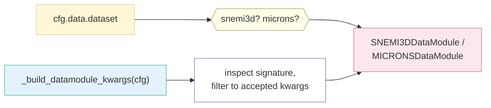
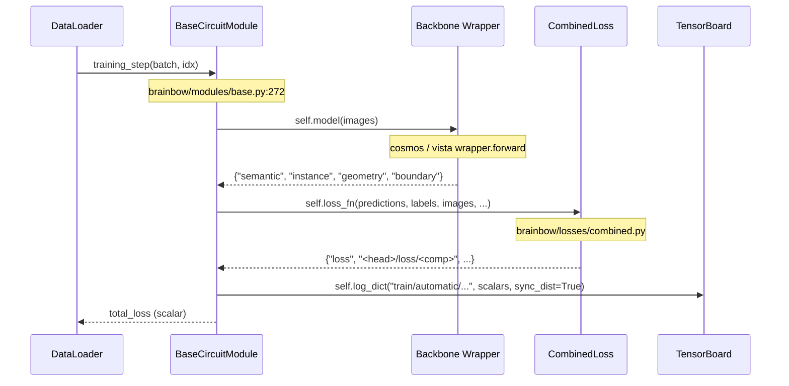
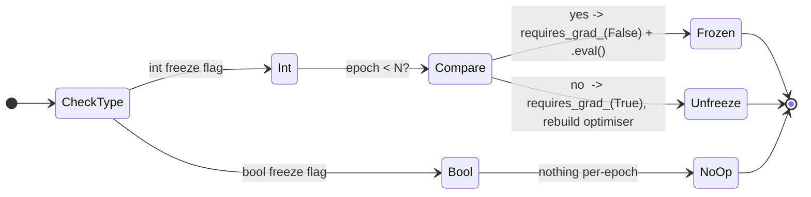

# Brainbow — End-to-end Walkthrough ("Follow One Batch")

> Audience: anyone who wants to understand how a single training step
> actually flows through brainbow, with file paths and line numbers so
> you can step through it in an editor.
>
> Companion docs:
> [`STRUCTURE.md`](./STRUCTURE.md) (file tree),
> [`ORGANIZATION.md`](./ORGANIZATION.md) (design patterns),
> [`ARCHITECT.md`](./ARCHITECT.md) (model parameter budgets),
> [`GOTCHAS.md`](./GOTCHAS.md) (silent failure modes).

This document follows what happens between

```bash
python scripts/train.py --config-name snemi3d
```

and the first scalar arriving in TensorBoard.  It is intentionally
verbose and cites file:line for every hop so you can switch between
this doc and the source code without losing your place.

---

## 0. The 30-second mental model

```mermaid
flowchart LR
    YAML["configs/<name>.yaml"]:::cfg --> CLI["scripts/train.py"]:::cli
    CLI -->|"get_datamodule"| DM["CircuitDataModule"]:::dm
    CLI -->|"get_module"| MOD["BaseCircuitModule\n(Vista3D / Cosmos3D)"]:::mod
    CLI -->|"setup_callbacks"| CB["ImageLogger,\nMemoryLogger,\nCheckpoint, ..."]:::cb
    CLI -->|"pl.Trainer.fit"| LOOP["Lightning Trainer Loop"]:::loop

    DM -.batch.-> LOOP
    LOOP -.training_step.-> MOD
    MOD --> WRAP["model wrapper\n(forward)"]:::wrap
    WRAP --> HEADS["semantic / instance /\ngeometry / boundary"]:::heads
    HEADS --> LOSS["CombinedLoss"]:::loss
    LOSS --> METRICS["per-head\nscalars / metrics"]:::metric
    METRICS --> TB[("TensorBoard /\nW&B logs")]:::tb
    CB -.|on_batch_end\non_epoch_end|.-> TB

    classDef cfg fill:#fff7d6,stroke:#dca,color:#333;
    classDef cli fill:#e3f2fd,stroke:#5b9,color:#333;
    classDef dm fill:#fde7ef,stroke:#c79,color:#333;
    classDef mod fill:#e8f5e9,stroke:#7a9,color:#333;
    classDef cb fill:#f3e5f5,stroke:#a7c,color:#333;
    classDef loop fill:#fffde7,stroke:#aa6,color:#333;
    classDef wrap fill:#e8f5e9,stroke:#7a9,color:#333;
    classDef heads fill:#fff,stroke:#aaa,color:#333;
    classDef loss fill:#fbe9e7,stroke:#c87,color:#333;
    classDef metric fill:#e1f5fe,stroke:#59a,color:#333;
    classDef tb fill:#ede7f6,stroke:#86c,color:#333;
```



Everything below zooms into one piece of this diagram.

---

## 1. CLI entry point

`scripts/train.py:main` (`@hydra.main` wrapper at line 398) is the only
entry point; everything else is called from it.

What happens, in order:

| Step | Lines      | Effect                                                                     |
| ---- | ---------- | -------------------------------------------------------------------------- |
| 1    | `400-404`  | Print resolved YAML to stdout (good first-look sanity check).              |
| 2    | `407-411`  | Make a unique `outputs/<timestamp>_<name>/` run directory.                 |
| 3    | `413-415`  | `pl.seed_everything(seed, workers=True)`.                                  |
| 4    | `417-422`  | Build the **DataModule** — see §2.                                         |
| 5    | `423-432`  | Build the **Lightning Module** — see §3.                                   |
| 6    | `446-456`  | Optional `torch.compile` on the **DiT backbone only** (avoids inference-mode tensors leaking into `backward` under DDP). |
| 7    | `458-464`  | Build callbacks, logger, profiler — see §4.                                |
| 8    | `467-488`  | Construct `pl.Trainer`.                                                    |
| 9    | `500`      | `_resolve_checkpoint(cfg, module)` -- pick **resume** or **weights-only** load. |
| 10   | `503-518`  | `trainer.fit(...)` inside a `try/except` that writes a `crash_recovery.ckpt` if anything throws and re-raises. |
| 11   | `520-527`  | Save `final_model.ckpt` on rank 0.                                          |

Two import-time side effects to remember:

* `scripts/train.py:43-47` -- **silenced warnings** (deprecation noise
  from `torch.compile` + Lightning).
* `scripts/train.py:58-86` -- **monkey-patches `torch.load`** to use
  `weights_only=False`.  This is required because Lightning checkpoints
  pickle `defaultdict` / `OmegaConf` containers that the
  `weights_only=True` unpickler refuses, and the `add_safe_globals`
  allow-list covers the *types* but not the `SETITEM` opcode for
  custom containers.  See [`GOTCHAS.md`](./GOTCHAS.md) #1.

These should one day move into a function called from `main`; tracked
in Phase 3a of the audit overhaul.

---

## 2. DataModule construction

`scripts/train.py:get_datamodule` (line 169):



Key decisions made here:

* `_head_weight_scalar(loss, "geometry") > 0` (line `145`) decides
  whether the datamodule precomputes direction + covariance fields.
  This is one of the few code-only fallbacks; the rest of the loss
  config is opaque to the data path.  See
  [`brainbow/datamodules/base.py:217-260`](../brainbow/datamodules/base.py)
  for the actual MONAI pipeline assembly.
* `inspect.signature(cls).parameters` (line `193`) filters kwargs so
  older datamodule signatures don't `TypeError` on a new YAML knob.

The returned `CircuitDataModule` exposes `setup()` / `train_dataloader()` /
`val_dataloader()` / `test_dataloader()`; everything else is loaded
lazily.

---

## 3. Lightning module construction

`scripts/train.py:get_module` (line 198) maps `cfg.model.type` to
`Vista3DModule` / `CosmosTransfer3DModule` and forwards four config
sub-dicts:

```python
return cls(
    model_config=model_cfg,        # network shape + freeze flags
    optimizer_config=...,           # AdamW lr, weight_decay, schedule
    loss_config=...,                # head weights + sub-weights
    training_config=...,            # disable_train_eval, etc.
)
```

What `BaseCircuitModule.__init__` does
(`brainbow/modules/base.py:131-225`):

1. Pops out **disabled heads** (head weight `0` -> head not constructed,
   not just zeroed) at line `151-156`.  Memory + speed win.
2. Calls `_build_model(model_config)` which by default forwards every
   key as a kwarg to `_model_cls`.  Cosmos overrides this in
   `modules/cosmos_transfer_2_5/base.py` to surface the freeze knobs
   and the `dit_backbone_lr` parameter group.
3. Constructs `_loss_cls(**loss_config, disabled_heads=...)`; for
   :class:`CombinedLoss` this is where weight-`0` heads are skipped.
4. Builds metric accumulators (`per_batch_*`).
5. Builds a clusterer (`build_clusterer(...)`) for the instance head's
   eval-time clustering.

---

## 4. Callbacks

`scripts/train.py:setup_callbacks` (line 230) is a flat list of
"if `callbacks.<name>.enabled` then add it" guards.  The default set is:

| Callback                    | Source                                                            | Why                                                                  |
| --------------------------- | ----------------------------------------------------------------- | -------------------------------------------------------------------- |
| `CudaEmptyCacheCallback`    | `brainbow/callbacks/memory.py`                                    | Empty CUDA caching allocator before each val epoch.                  |
| `CudaMemoryLoggerCallback`  | same                                                              | Log allocated/reserved/fragmentation under `cuda_memory/*`.          |
| `ModelCheckpoint`           | Lightning                                                         | Save top-k by `val/automatic/loss`, plus `last.ckpt`.                |
| `EarlyStopping` (opt-in)    | Lightning                                                         | Disabled by default.                                                 |
| `LearningRateMonitor`       | Lightning                                                         | One scalar per param group per step.                                 |
| `ImageLogger`               | `brainbow/callbacks/tensorboard/image_logger.py`                  | The big one -- see §7.                                               |
| `RichProgressBar`           | Lightning                                                         | Prettier `tqdm`.                                                     |
| `ModelSummary(max_depth=2)` | Lightning                                                         | Module tree + parameter count at fit start.                          |

---

## 5. Inside `trainer.fit` — one training step

This is the part that runs **once per batch**, every step.



### 5.1 Where the four heads come from

| Head        | Cosmos `wrapper.forward`                              | Vista `wrapper.forward`             |
| ----------- | ----------------------------------------------------- | ----------------------------------- |
| `semantic`  | `head_semantic(decoder_features)` -> `[B, C, ...]`    | `head_semantic(backbone_features)`  |
| `instance`  | `head_instance(decoder_features)` -> `[B, E, ...]`    | `head_instance(...)`                |
| `geometry`  | `head_geometry(decoder_features)` -> `[B, G, ...]`    | `head_geometry(...)`                |
| `boundary`  | `head_boundary(decoder_features)` -> `[B, 10, ...]`   | **not present** (Vista is 3-head)   |

Activation policy (applied **once**, in the wrapper, before any loss
or metric or callback sees the prediction):

| Head        | Cosmos                                                 | Vista                            |
| ----------- | ------------------------------------------------------ | -------------------------------- |
| `semantic`  | `sigmoid` on every channel                             | `sigmoid` on every channel       |
| `instance`  | linear (unbounded embedding)                           | linear                           |
| `geometry`  | `sigmoid` on ch 0 (raw); linear on dir + cov           | linear (loss handles activation) |
| `boundary`  | `sigmoid` on every channel (all 10 targets ∈ `[0, 1]`) | n/a                              |

See `brainbow/models/cosmos_transfer_2_5/decoder.py` for the canonical
docstring on the policy; the loss modules consume probabilities (or
linear values) directly under that contract.

### 5.2 What `CombinedLoss` returns

`brainbow/losses/combined.py:CombinedLoss.forward` returns a single
flat dict whose keys mirror the image-tag layout used by the
`ImageLogger` (image: `{head}/pred/<field>[/<panel>]` / scalar:
`{head}/loss/<field>[/<component>]`):

```
loss                                       # scalar total (we backprop this)
{head}/loss                                # per-head total, weighted
{head}/loss/{component}                    # flat per-head breakdown
{head}/loss/<field>[/<component>]          # per-field breakdown,
                                           # parallels {head}/pred/<field>
eff_w/{head}                               # effective task weight
                                           # (learned-task-weight mode)
```

So e.g. `instance/loss/emb/aff` accompanies the image tag
`instance/pred/emb/aff/{t,b,u,d,l,r}`, both produced from the
embedding via `soft_aff_from_field`; `boundary/loss/avg/aff` pairs
with `boundary/pred/avg/aff/{...}`, etc.

`BaseCircuitModule.training_step`
(`brainbow/modules/base.py:272-324`) prefixes every key with
`train/automatic/` and calls `self.log_dict(..., sync_dist=True)`,
which is what TensorBoard eventually sees.

### 5.3 Optimiser parameter groups

`brainbow/modules/base.py:configure_optimizers` (line 501) splits
parameters into `weight_decay` / `no_weight_decay` (norms + biases).
The Cosmos module overrides this in
`brainbow/modules/cosmos_transfer_2_5/base.py` to add a third group
with `lr = optimizer.dit_backbone_lr` for the DiT backbone params; that
LR is **only honoured when the DiT is unfrozen**, see §6.

---

## 6. Freeze schedule (Cosmos only)

`brainbow/modules/cosmos_transfer_2_5/base.py:on_train_epoch_start`:



* `freeze_dit_backbone: true`  -> permanently frozen.
* `freeze_dit_backbone: false` -> permanently trainable.
* `freeze_dit_backbone: 2`     -> frozen during epochs 0 and 1,
  unfrozen at the start of epoch 2 (optimizer rebuilt at that hop so
  the new param group picks up `dit_backbone_lr`).

The integer form is the production default in `configs/snemi3d.yaml`.
See also [`ARCHITECT.md` §1.6](./ARCHITECT.md#16-freeze-flags--what-actually-moves)
for the parameter-budget consequences.

---

## 7. ImageLogger — what produces the picture in TB

`brainbow/callbacks/tensorboard/image_logger.py:ImageLogger`.

Once per `every_n_epochs` (default 1), on rank 0 only:

1. `on_train_batch_end` / `on_validation_batch_end` cache the **first
   batch of the epoch** to CPU (`_detach_batch`).
2. At epoch end, `_run_visualization` moves the cached batch back to
   the device, runs a single eval-mode forward under autocast, casts
   predictions back to fp32.
3. (Optional) `build_boundary_target(...)` rebuilds the 10-channel
   ground-truth target for the `true/...` panels.
4. `_log_predictions(...)` dispatches per head to:
   * `_log_semantic` (CE-style overlay panel)
   * `_log_instance` (PCA-projected embedding under `pred/emb/{pca|svd|umap}`,
     kernel-derived 6-aff under `pred/emb/aff/{t,b,u,d,l,r}` from
     `soft_aff_from_field`, plus the clusterer-output overlay under
     `pred/label`)
   * `_log_geometry` (matplotlib quiver / covariance ellipse glyphs)
   * `_log_boundary` (raw / avg RGB panel + per-axis direct affinity
     under `aff/{t,b,u,d,l,r}`, plus a derived `pred/avg/aff/{...}`
     panel computed from the predicted avgloc via `soft_aff_from_avg`)
5. Every tag is built through `TagContext.tag(panel)` so the resulting
   path is exactly `{stage}/{mode}/[{head}/]{panel}`.

This is why scalars and images for the same head cluster together in
TensorBoard's Images and Scalars tabs.

---

## 8. Validation step + clustering

`BaseCircuitModule.validation_step` (line 474) calls
`_eval_step_and_accumulate` (line 326).  That function:

1. Forward the batch.
2. Apply `CombinedLoss` (validation loss).
3. **Cluster** the instance embedding into a per-voxel ID map using
   `self.clusterer(...)` (built by `build_clusterer` from
   `training.clusterer.*`).
4. Accumulate per-batch metrics (`per_batch_ari`, `per_batch_voi`,
   `per_batch_dice`, ...).
5. On epoch end, all-reduce the accumulators across ranks and log them
   under `val/automatic/{head}/metric/{name}`.

Clusterers live in
`brainbow/inference/clusterer.py:build_clusterer` (line 723); the
default for the instance head is :class:`SoftMeanShift`.

### 8.1 Val/test transform pipeline (deterministic)

`brainbow/datamodules/base.py::CircuitDataModule.get_val_transforms`
intentionally diverges from the train pipeline:

```
EnsureChannelFirst → [FindBoundaries(prob=1.0)]
→ [Pad + CenterCrop(patch_size)]   # or Resize(image_size)
→ instance_transforms (CC relabel, deterministic)
→ geometry_transforms (Direction, Covariance — deterministic)
→ EnsureType
```

No `RandFlip`, no `RandRotate90`, no `RandTransposeXY`, no
`Rand3DElastic`, no `RandGaussianNoise`, no `RandAdjustContrast`.
The eval crops are deterministic (center crop) so the same volume
produces the same patch every epoch and the metrics are comparable
across runs.  See [`GOTCHAS.md` #26](./GOTCHAS.md) for the historical
bug (eval used to share the train pipeline's random hooks).

---

## 9. Sliding-window inference (test/predict path)

When the test set has volumes too big to fit on the GPU,
`brainbow/inference/sliding_window.py:sliding_window_inference` is the
entry point.  It:

1. Iterates patch starts on a regular grid with a configurable overlap.
2. Forwards each patch through the wrapped model.
3. Blends per-patch outputs via gaussian / average / max weights.
4. Returns the full-volume prediction for the (currently aggregated)
   heads -- see [`GOTCHAS.md` #4](./GOTCHAS.md) for the
   geometry/boundary head limitation.

`scripts/train.py` does **not** call this path; it's invoked from
`trainer.test(...)` and from notebook code that wants an offline
prediction map.

---

## 10. Where to look for what

| Curious about ...                 | Read first ...                                                                  |
| --------------------------------- | ------------------------------------------------------------------------------- |
| Augmentation order                | `brainbow/datamodules/base.py::CircuitDataModule.get_train_transforms`          |
| Loss target construction          | `brainbow/losses/<name>.py::*build_target*` methods                             |
| TensorBoard tag layout            | `brainbow/callbacks/tensorboard/tags.py::TagContext`                            |
| Freeze schedule                   | `brainbow/modules/cosmos_transfer_2_5/base.py::on_train_epoch_start`            |
| Param-group split                 | `brainbow/modules/cosmos_transfer_2_5/base.py::configure_optimizers`            |
| Clustering algorithms             | `brainbow/inference/clusterer.py::build_clusterer`                              |
| Adding a new dataset/head/...     | [`CONTRIBUTING.md`](./CONTRIBUTING.md)                                          |
| Silent failure modes              | [`GOTCHAS.md`](./GOTCHAS.md)                                                    |
| Parameter budgets                 | [`ARCHITECT.md`](./ARCHITECT.md)                                                |
| File tree                         | [`STRUCTURE.md`](./STRUCTURE.md)                                                |
| Design patterns                   | [`ORGANIZATION.md`](./ORGANIZATION.md)                                          |
